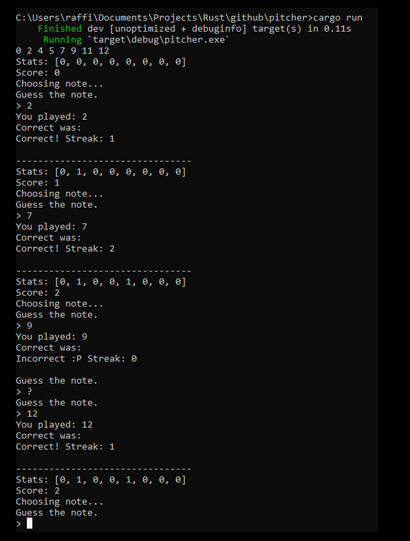

# pitcher
command line note identification game

notes are currently labeled from 0 to 12, in C major scale

```
C D E F G A  B  C
0 2 4 5 7 9 11 12
```

the game will randomly choose a note from those and you must guess which number it picked based on sound

if you forget which note it played, type `?` and it will repeat the note



the game will kindasorta try to balance the notes out based on which ones you have lower scores on

have fun or whatever
