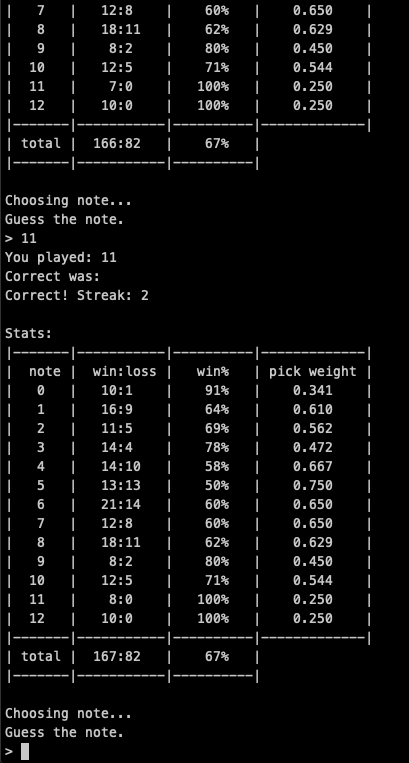

# pitcher
command line note identification game

notes are currently labeled from 0 to 12, in C major scale

```
C D E F G A  B  C
0 2 4 5 7 9 11 12
```

the game will first play the whole scale at the start of the game.
then, it will randomly choose a note from those, play it, and you must guess which number it picked based on sound.

once you guess a note, the game will play both your note and the actual note for you to compare.
it will then change your score based on whether you got it right.

if you forget which note it played, type `?` and it will play the note again.
there is currently no way to replay the whole scale.

Note: this image is outdated


the game will kindasorta try to balance the notes out based on which ones you have lower scores on.

have fun or whatever idk ☕
